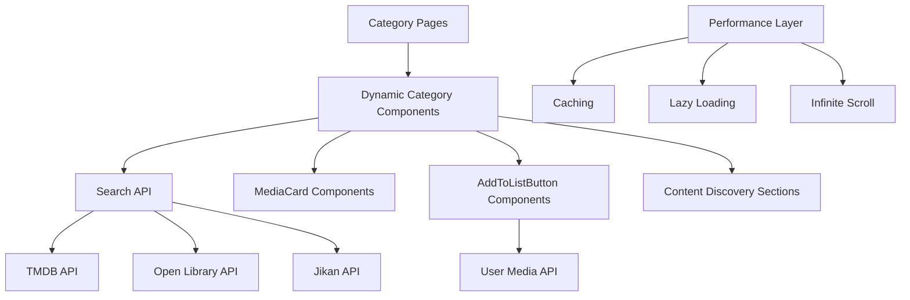

# Design Document: Media Pages Integration

## Overview

This feature modernizes the existing static media category pages (movies, anime, books) to integrate with the platform's dynamic search and media management system. The current pages use outdated static components that display hardcoded content from JSON files and don't provide proper user interaction capabilities. This design transforms them into dynamic, interactive pages that leverage the existing search API, MediaCard components, and AddToListButton functionality.

The solution maintains the existing page structure while replacing static components with dynamic ones that provide search, filtering, content discovery, and list management capabilities.

## Architecture

### High-Level Architecture



### Component Architecture

The design follows a modular approach where each category page uses a shared dynamic component architecture:

1. **Category Page Container**: Main page component that handles routing and layout
2. **Dynamic Category Component**: Core component that manages content display and user interactions
3. **Content Sections**: Modular sections for different content discovery types
4. **Search Integration**: Built-in search functionality specific to each media type
5. **Performance Optimizations**: Caching, lazy loading, and infinite scroll

## Components and Interfaces

### 1. Dynamic Category Components

**Purpose**: Replace static MovieCards, AnimeCards, and BooksCards components with dynamic equivalents.

**Design Decision**: Create unified `DynamicMediaGrid.astro` component that can handle all media types rather than separate components. This reduces code duplication and ensures consistent behavior across all category pages.

**Interface**:
```typescript
interface DynamicMediaGridProps {
  mediaType: 'movie' | 'tv' | 'book' | 'anime' | 'manga';
  initialContent?: SearchResult[];
  showSearch?: boolean;
  showFilters?: boolean;
  sections: ContentSection[];
}

interface ContentSection {
  id: string;
  title: string;
  type: 'popular' | 'trending' | 'top_rated' | 'recommended';
  query?: string;
  filters?: Record<string, any>;
}
```

### 2. Search Integration

**Purpose**: Provide category-specific search functionality that filters results by media type.

**Design Decision**: Extend the existing search API to support media type filtering and integrate it directly into category pages rather than redirecting to the main search page. This provides a more seamless user experience.

**Implementation**:
- Use existing `/api/search.ts` endpoint with `type` parameter
- Add debounced search input to prevent excessive API calls
- Implement search state management to maintain user's search context

### 3. Content Discovery Sections

**Purpose**: Provide curated content sections for different discovery patterns.

**Design Decision**: Create flexible section system that can display different types of content (popular, trending, recommended) using the same underlying components but with different data sources.

**Sections**:
- **Popular**: Most popular content from external APIs
- **Trending**: Currently trending content
- **Top Rated**: Highest rated content
- **Recommended**: Personalized recommendations for logged-in users

### 4. Enhanced MediaCard Integration

**Purpose**: Use existing MediaCard component with category-specific optimizations.

**Design Decision**: Extend the existing MediaCard component rather than creating new ones to maintain consistency across the platform.

**Enhancements**:
- Add category-specific metadata display
- Optimize for grid layouts on category pages
- Integrate with AddToListButton for seamless list management

### 5. Filter and Sort System

**Purpose**: Allow users to filter and sort content within categories.

**Design Decision**: Implement client-side filtering for basic filters (year, rating) and server-side filtering for complex queries to balance performance and functionality.

**Filters**:
- **Year Range**: Filter by release/publication year
- **Rating**: Filter by minimum rating
- **Genre**: Filter by genre (when available from APIs)
- **Status**: Filter by user's list status (for logged-in users)

## Data Models

### Content Section Model
```typescript
interface ContentSection {
  id: string;
  title: string;
  type: 'popular' | 'trending' | 'top_rated' | 'recommended';
  mediaType: MediaType;
  items: SearchResult[];
  loading: boolean;
  error?: string;
  hasMore: boolean;
  page: number;
}
```

### Search State Model
```typescript
interface SearchState {
  query: string;
  filters: {
    year?: { min?: number; max?: number };
    rating?: { min?: number };
    genre?: string[];
    status?: UserMediaStatus[];
  };
  sort: 'relevance' | 'rating' | 'year' | 'title';
  page: number;
  loading: boolean;
  results: SearchResult[];
  total: number;
}
```

### Category Page State Model
```typescript
interface CategoryPageState {
  mediaType: MediaType;
  activeSection: string;
  sections: Map<string, ContentSection>;
  searchState: SearchState;
  user?: {
    isLoggedIn: boolean;
    mediaList: UserMedia[];
  };
}
```

## Error Handling

### API Error Handling
- **Graceful Degradation**: If external APIs fail, show cached content or fallback messages
- **Retry Mechanism**: Implement exponential backoff for failed API requests
- **User Feedback**: Display user-friendly error messages with retry options
- **Partial Failures**: Handle cases where some APIs succeed and others fail

### Network Error Handling
- **Offline Support**: Cache content for offline viewing
- **Slow Network**: Show progressive loading states and skeleton screens
- **Timeout Handling**: Set reasonable timeouts for API calls and show appropriate messages

### User Error Handling
- **Invalid Searches**: Provide search suggestions and clear error messages
- **Authentication Errors**: Redirect to login when required for list management
- **Validation Errors**: Show inline validation for filters and search inputs

## Testing Strategy

### Unit Testing
- **Component Testing**: Test individual components in isolation
- **API Integration**: Mock external API responses for consistent testing
- **State Management**: Test search and filter state transitions
- **Error Scenarios**: Test error handling and recovery mechanisms

### Integration Testing
- **End-to-End Flows**: Test complete user journeys from category page to media detail
- **Cross-Browser Testing**: Ensure compatibility across different browsers
- **Performance Testing**: Test loading times and responsiveness
- **Accessibility Testing**: Ensure WCAG compliance for all interactions

### Performance Testing
- **Load Testing**: Test with large datasets and multiple concurrent users
- **API Response Times**: Monitor and test API response times
- **Memory Usage**: Test for memory leaks in infinite scroll scenarios
- **Cache Effectiveness**: Verify caching improves performance

## Performance Optimizations

### Caching Strategy
- **API Response Caching**: Cache search results and content sections using existing cache system
- **Image Caching**: Leverage browser caching for poster images
- **State Caching**: Cache user preferences and search history locally

### Loading Optimizations
- **Lazy Loading**: Use existing LazyImage component for poster images
- **Infinite Scroll**: Implement infinite scroll using existing InfiniteScroll component
- **Progressive Loading**: Show skeleton screens while content loads
- **Preloading**: Preload next page of results when user approaches end of current page

### Bundle Optimization
- **Code Splitting**: Split category-specific code into separate bundles
- **Tree Shaking**: Remove unused code from external API integrations
- **Component Reuse**: Maximize reuse of existing components to reduce bundle size

## Security Considerations

### API Security
- **Rate Limiting**: Implement client-side rate limiting for external API calls
- **API Key Protection**: Ensure API keys are properly secured on server-side
- **Input Sanitization**: Sanitize all user inputs for search and filters

### User Data Protection
- **Authentication**: Verify user authentication for list management features
- **Data Privacy**: Respect user privacy settings for recommendations
- **CSRF Protection**: Use existing CSRF protection for API calls

## Migration Strategy

### Phase 1: Infrastructure Setup
1. Create new dynamic components alongside existing static ones
2. Set up API integrations and caching
3. Implement basic search functionality

### Phase 2: Component Replacement
1. Replace static components with dynamic ones page by page
2. Maintain backward compatibility during transition
3. Test thoroughly before removing old components

### Phase 3: Feature Enhancement
1. Add advanced filtering and sorting
2. Implement personalized recommendations
3. Optimize performance and user experience

### Rollback Plan
- Keep existing static components as fallback
- Feature flags to switch between old and new implementations
- Database rollback procedures for any schema changes

## Accessibility Considerations

### Keyboard Navigation
- **Tab Order**: Ensure logical tab order through search, filters, and content
- **Keyboard Shortcuts**: Implement keyboard shortcuts for common actions
- **Focus Management**: Properly manage focus during dynamic content updates

### Screen Reader Support
- **ARIA Labels**: Add appropriate ARIA labels for dynamic content
- **Live Regions**: Use ARIA live regions for search results and loading states
- **Semantic HTML**: Use proper semantic HTML structure for content sections

### Visual Accessibility
- **Color Contrast**: Ensure sufficient color contrast for all text and interactive elements
- **Focus Indicators**: Provide clear focus indicators for keyboard navigation
- **Responsive Design**: Ensure accessibility across different screen sizes and zoom levels

## Monitoring and Analytics

### Performance Monitoring
- **Page Load Times**: Monitor category page load performance
- **API Response Times**: Track external API performance
- **User Engagement**: Monitor user interaction with different content sections

### Error Monitoring
- **API Failures**: Track and alert on external API failures
- **Client Errors**: Monitor JavaScript errors and user-reported issues
- **Search Analytics**: Track search queries and success rates

### User Analytics
- **Content Discovery**: Track which content sections are most popular
- **Search Patterns**: Analyze user search behavior and preferences
- **Conversion Rates**: Monitor how often users add items to their lists from category pages