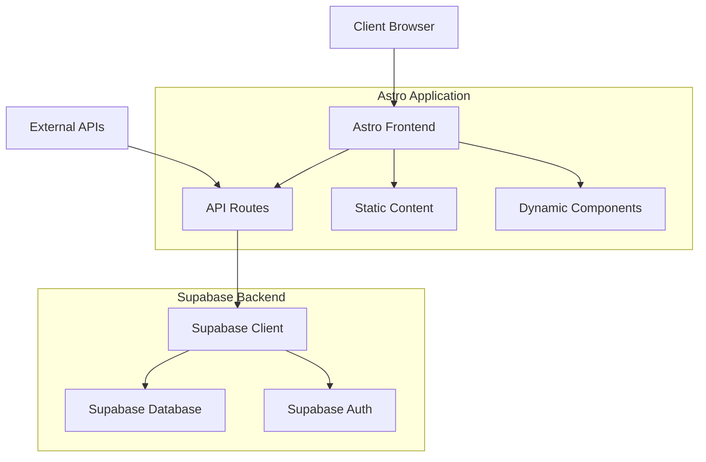

# Design Document

## Overview

The media tracking platform will be built on the existing Astro + Supabase foundation, extending it into a comprehensive social media platform for tracking movies, books, anime, and TV shows. The architecture leverages Astro's server-side rendering capabilities, Supabase for authentication and database management, and implements a modular component-based design for scalability.

The platform will transform the current static content display into a dynamic, user-driven experience where authenticated users can search, track, rate, and socially interact around media content. The design emphasizes performance, user experience, and social engagement while maintaining the existing aesthetic and technical foundation.

## Architecture

### High-Level Architecture



### Technology Stack

- **Frontend**: Astro 4.x with TypeScript, TailwindCSS, AlpineJS
- **Backend**: Astro API routes with Supabase integration
- **Database**: Supabase PostgreSQL with Row Level Security
- **Authentication**: Supabase Auth with email/password and social providers
- **Deployment**: Vercel with serverless functions
- **External APIs**: TMDB API for movies/TV, Open Library API for books, Jikan API for anime

### Data Flow

1. **Authentication Flow**: User authenticates via Supabase Auth, session stored in HTTP-only cookies
2. **Search Flow**: Client searches → API route → External APIs → Normalized results → Client
3. **User Action Flow**: User action → API route → Supabase database → Real-time updates
4. **Social Flow**: User interactions → Database updates → Activity feeds → Real-time notifications

## Components and Interfaces

### Core Components

#### 1. Authentication Components
- **LoginForm.astro**: Enhanced login with better error handling and validation
- **RegisterForm.astro**: Improved registration with email confirmation flow
- **AuthGuard.astro**: Wrapper component for protected routes
- **UserMenu.astro**: User dropdown with profile, settings, logout options

#### 2. Search and Discovery Components
- **UniversalSearch.astro**: Global search component with filters and autocomplete
- **SearchResults.astro**: Displays paginated search results across all media types
- **MediaCard.astro**: Reusable card component for displaying media items
- **FilterPanel.astro**: Advanced filtering options for search results

#### 3. Media Management Components
- **MediaDetail.astro**: Comprehensive media information page
- **AddToListButton.astro**: Interactive button for adding items to user lists
- **StatusSelector.astro**: Dropdown for selecting watch/read status
- **RatingComponent.astro**: Star rating input and display component
- **ReviewForm.astro**: Form for writing and editing reviews

#### 4. User Profile Components
- **ProfileHeader.astro**: User avatar, stats, and basic info
- **MediaLists.astro**: Organized display of user's media lists
- **ActivityFeed.astro**: Recent user activity and interactions
- **StatsWidget.astro**: Visual statistics about user's media consumption

#### 5. Social Components
- **ReviewCard.astro**: Individual review display with like/unlike functionality
- **CommentSection.astro**: Comments on reviews with nested replies
- **UserCard.astro**: Compact user profile display for discovery
- **FollowButton.astro**: Follow/unfollow functionality

### API Interfaces

#### Authentication APIs
```typescript
// /api/auth/register.ts
POST /api/auth/register
Body: { email: string, password: string, username: string }
Response: { success: boolean, message: string }

// /api/auth/signin.ts  
POST /api/auth/signin
Body: { email: string, password: string }
Response: { success: boolean, user: User, redirectTo: string }

// /api/auth/signout.ts
POST /api/auth/signout
Response: { success: boolean }
```

#### Search APIs
```typescript
// /api/search.ts
GET /api/search?q={query}&type={media_type}&page={page}
Response: { results: MediaItem[], totalPages: number, currentPage: number }

// /api/media/{type}/{id}.ts
GET /api/media/movie/123
Response: { media: DetailedMediaItem, userStatus?: UserMediaStatus }
```

#### User Data APIs
```typescript
// /api/user/lists.ts
GET /api/user/lists?status={status}
POST /api/user/lists
Body: { mediaId: string, mediaType: string, status: string }

// /api/user/ratings.ts
POST /api/user/ratings
Body: { mediaId: string, rating: number, review?: string }

// /api/user/profile.ts
GET /api/user/profile/{userId}
PUT /api/user/profile
Body: { username?: string, bio?: string, privacy?: string }
```

## Data Models

### Enhanced Database Schema

#### User Management Tables
```sql
-- Enhanced user profiles
CREATE TABLE user_profiles (
    id UUID PRIMARY KEY REFERENCES auth.users(id),
    username VARCHAR(50) UNIQUE NOT NULL,
    display_name VARCHAR(100),
    bio TEXT,
    avatar_url TEXT,
    privacy_level VARCHAR(20) DEFAULT 'public',
    created_at TIMESTAMP DEFAULT NOW(),
    updated_at TIMESTAMP DEFAULT NOW()
);

-- User preferences and settings
CREATE TABLE user_preferences (
    user_id UUID PRIMARY KEY REFERENCES user_profiles(id),
    email_notifications BOOLEAN DEFAULT true,
    public_lists BOOLEAN DEFAULT true,
    public_ratings BOOLEAN DEFAULT true,
    preferred_language VARCHAR(10) DEFAULT 'en'
);
```

#### Media Tracking Tables
```sql
-- Unified media items table
CREATE TABLE media_items (
    id UUID PRIMARY KEY DEFAULT gen_random_uuid(),
    external_id VARCHAR(100) NOT NULL,
    media_type VARCHAR(20) NOT NULL, -- 'movie', 'tv', 'book', 'anime'
    title VARCHAR(500) NOT NULL,
    description TEXT,
    poster_url TEXT,
    release_date DATE,
    genres TEXT[],
    metadata JSONB, -- Flexible storage for type-specific data
    created_at TIMESTAMP DEFAULT NOW(),
    UNIQUE(external_id, media_type)
);

-- User media lists and status
CREATE TABLE user_media (
    id UUID PRIMARY KEY DEFAULT gen_random_uuid(),
    user_id UUID REFERENCES user_profiles(id),
    media_id UUID REFERENCES media_items(id),
    status VARCHAR(20) NOT NULL, -- 'completed', 'watching', 'plan_to_watch', 'dropped'
    rating INTEGER CHECK (rating >= 1 AND rating <= 10),
    review TEXT,
    started_at TIMESTAMP,
    completed_at TIMESTAMP,
    created_at TIMESTAMP DEFAULT NOW(),
    updated_at TIMESTAMP DEFAULT NOW(),
    UNIQUE(user_id, media_id)
);
```

#### Social Features Tables
```sql
-- User reviews and ratings
CREATE TABLE reviews (
    id UUID PRIMARY KEY DEFAULT gen_random_uuid(),
    user_id UUID REFERENCES user_profiles(id),
    media_id UUID REFERENCES media_items(id),
    rating INTEGER CHECK (rating >= 1 AND rating <= 10),
    title VARCHAR(200),
    content TEXT NOT NULL,
    spoiler_warning BOOLEAN DEFAULT false,
    like_count INTEGER DEFAULT 0,
    created_at TIMESTAMP DEFAULT NOW(),
    updated_at TIMESTAMP DEFAULT NOW()
);

-- Review likes/reactions
CREATE TABLE review_likes (
    id UUID PRIMARY KEY DEFAULT gen_random_uuid(),
    user_id UUID REFERENCES user_profiles(id),
    review_id UUID REFERENCES reviews(id),
    created_at TIMESTAMP DEFAULT NOW(),
    UNIQUE(user_id, review_id)
);

-- User following system
CREATE TABLE user_follows (
    id UUID PRIMARY KEY DEFAULT gen_random_uuid(),
    follower_id UUID REFERENCES user_profiles(id),
    following_id UUID REFERENCES user_profiles(id),
    created_at TIMESTAMP DEFAULT NOW(),
    UNIQUE(follower_id, following_id),
    CHECK(follower_id != following_id)
);

-- Activity feed
CREATE TABLE user_activities (
    id UUID PRIMARY KEY DEFAULT gen_random_uuid(),
    user_id UUID REFERENCES user_profiles(id),
    activity_type VARCHAR(50) NOT NULL,
    media_id UUID REFERENCES media_items(id),
    metadata JSONB,
    created_at TIMESTAMP DEFAULT NOW()
);
```

### TypeScript Interfaces

```typescript
interface User {
    id: string;
    email: string;
    username: string;
    displayName?: string;
    bio?: string;
    avatarUrl?: string;
    privacyLevel: 'public' | 'private' | 'friends';
    createdAt: Date;
}

interface MediaItem {
    id: string;
    externalId: string;
    mediaType: 'movie' | 'tv' | 'book' | 'anime';
    title: string;
    description?: string;
    posterUrl?: string;
    releaseDate?: Date;
    genres: string[];
    metadata: Record<string, any>;
}

interface UserMedia {
    id: string;
    userId: string;
    mediaId: string;
    status: 'completed' | 'watching' | 'plan_to_watch' | 'dropped';
    rating?: number;
    review?: string;
    startedAt?: Date;
    completedAt?: Date;
    media: MediaItem;
}

interface Review {
    id: string;
    userId: string;
    mediaId: string;
    rating: number;
    title?: string;
    content: string;
    spoilerWarning: boolean;
    likeCount: number;
    createdAt: Date;
    user: User;
    media: MediaItem;
    isLikedByCurrentUser?: boolean;
}
```

## Error Handling

### Client-Side Error Handling
- **Form Validation**: Real-time validation with clear error messages
- **Network Errors**: Retry mechanisms with exponential backoff
- **Authentication Errors**: Automatic redirect to login with return URL
- **Rate Limiting**: Graceful degradation with user feedback

### Server-Side Error Handling
```typescript
// Standardized error response format
interface APIError {
    success: false;
    error: {
        code: string;
        message: string;
        details?: any;
    };
}

// Error handling middleware
export function handleAPIError(error: any): Response {
    if (error.code === 'PGRST301') {
        return new Response(JSON.stringify({
            success: false,
            error: { code: 'NOT_FOUND', message: 'Resource not found' }
        }), { status: 404 });
    }
    
    // Log error for monitoring
    console.error('API Error:', error);
    
    return new Response(JSON.stringify({
        success: false,
        error: { code: 'INTERNAL_ERROR', message: 'Something went wrong' }
    }), { status: 500 });
}
```

### Database Error Handling
- **Constraint Violations**: User-friendly messages for duplicate entries
- **Connection Issues**: Automatic retry with circuit breaker pattern
- **Transaction Failures**: Proper rollback and user notification
- **Row Level Security**: Clear authorization error messages

## Testing Strategy

### Unit Testing
- **Component Testing**: Test individual Astro components with Vitest
- **API Route Testing**: Test all API endpoints with mock data
- **Utility Function Testing**: Test helper functions and data transformations
- **Database Function Testing**: Test custom PostgreSQL functions

### Integration Testing
- **Authentication Flow**: End-to-end user registration and login
- **Media Management**: Complete user journey from search to list management
- **Social Features**: User interactions and activity feed updates
- **External API Integration**: Mock external API responses for consistent testing

### End-to-End Testing
- **User Workflows**: Complete user journeys using Playwright
- **Cross-Browser Testing**: Ensure compatibility across major browsers
- **Mobile Responsiveness**: Test responsive design on various screen sizes
- **Performance Testing**: Load testing for database queries and API responses

### Testing Infrastructure
```typescript
// Test configuration
export const testConfig = {
    supabase: {
        url: process.env.SUPABASE_TEST_URL,
        key: process.env.SUPABASE_TEST_KEY
    },
    externalAPIs: {
        mock: true, // Use mock responses in tests
        timeout: 5000
    }
};

// Database test helpers
export async function createTestUser(): Promise<User> {
    // Create test user with cleanup
}

export async function cleanupTestData(): Promise<void> {
    // Clean up test data after tests
}
```

### Performance Considerations
- **Database Indexing**: Optimize queries with proper indexes on frequently searched columns
- **Caching Strategy**: Implement Redis caching for external API responses and user sessions
- **Image Optimization**: Use Astro's image optimization for media posters and user avatars
- **Lazy Loading**: Implement infinite scroll for large lists and search results
- **CDN Integration**: Serve static assets through Vercel's CDN for global performance